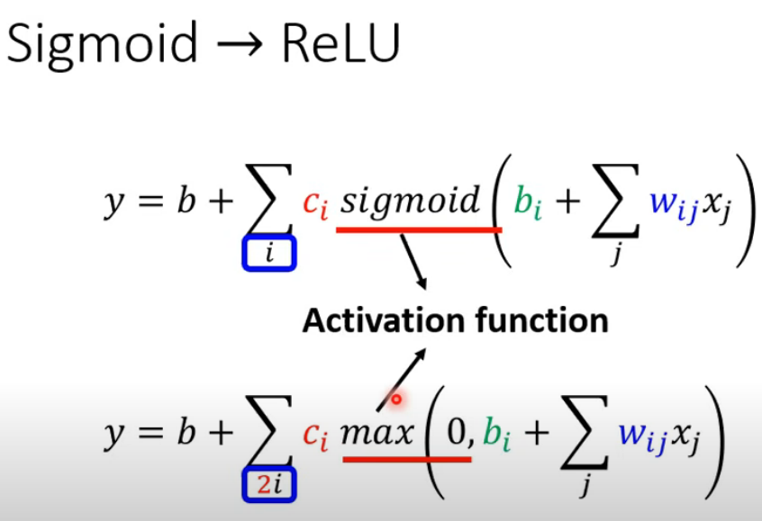

# ML
## ML_Tasks:
1. Regression:The function outputs a scalar.
2. Classification:Given options(classes),the function outputs the correct ont.
3. Structed learning
## ML_Steps:
1. Function with Unknown Parameters  
   >for instance:y=b+wx1,the function is called **Model**,x1 is called **feature**,w is called **weight**,b is called **bias**,the true value(__$\hat{y}$__) is called **label**
2. Define Loss from Training Data
   >Loss is a function of parameters:**L(b,w)**
   Loss:how good a set of values is.
   $L = \frac{1}{N} \sum_{i=1}^{n} (e_\theta)$.
   >* e=|y-$\hat{y}$| L is mean absolute error(**MAE**)
   >* e=(y-$\hat{y}$)^2 L is mean square error(**MSE**) 
   >* if y and $\hat{y}$ are both probability distributions ,we use **Cross-entropy**
3. Optimization
    $w^*,x^*=\arg\min_{w,x}{L}$
    Method:**Gradient Descent**
   >1. (Randomly)Pick an initial value w^0^
   >2. Compute$\left. \frac{\partial L}{\partial w} \right|_{w=w_0}$
   >3. $w_1=w_0-\delta{\left. \frac{\partial L}{\partial w} \right|_{w=w_0}}$  
   **$\delta$** is called **learning rate** and ***hyperparameters***
   >4. Update $w$ iteratively
## ML_Update:
1. step1:**New Model**
   $y=b+c^T*\sigma(\mathbf{b}+\mathbf{Wx})$
   >$\sigma(x) = \frac{1}{1 + e^{-x}}$
2. step2:**$L=L(\mathbf{\theta^0})$**
3. step3:Gradient:**$g=\Delta(\mathbf{\theta^0})$**
   >$\theta^0=\begin{pmatrix}\theta_{1}^{0} \\ \theta_{2}^{0} \\ \theta_{3}^{0} \\ \vdots \end{pmatrix}$
4. Update:**$\theta^1=\begin{pmatrix}\theta_{1}^{1} \\ \theta_{2}^{1} \\ \theta_{3}^{1} \\ \vdots \end{pmatrix}=\begin{pmatrix}\theta_{1}^{0} \\ \theta_{2}^{0} \\ \theta_{3}^{0} \\ \vdots \end{pmatrix}-\begin{pmatrix} \delta{\left. \frac{\partial L}{\partial \theta_{1}} \right|_{\theta=\theta_0}} \\ \delta{\left. \frac{\partial L}{\partial \theta_{2}} \right|_{\theta=\theta_0}} \\ \delta{\left. \frac{\partial L}{\partial \theta_{3}} \right|_{\theta=\theta_0}} \\ \vdots \end{pmatrix}$**
   >$\theta^1=\theta^0-\delta{g}$  
   >$\theta^*=\arg\min_\theta{L}$
5. we can also replace sigmoid with ReLU
   >ReLU:$\max(\mathbf{b}+\mathbf{Wx})$,and **i** is replaced by **2*i**
   >
6. we can do the same model so many times to decline the loss(layers).Making the $y$ as a new $x$ to do $y^1=b+c^T*\sigma(\mathbf{b}+\mathbf{Wy})$