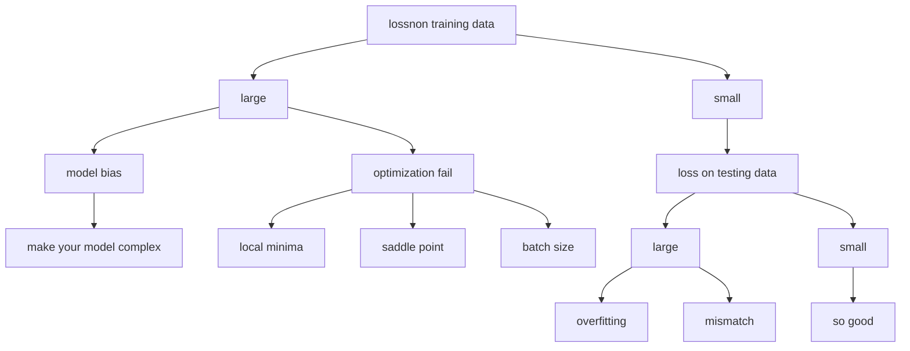

# 1. Minimum , overfitting and Saddle Point

>1. Only the **loss on testing data** is **large** and **loss on training data** is **small**,it is called **overfiting**
## 1. solve overfitting:
### 1. more training data
### 2. data augmentation
### 3. constrained model(make yout model simpler)
## 2. but theoverfitting and model bias's solutions is conflict,so we need trade-off
### 1. split your training data into training set and validation set for model selection(n-fold cross validation)
## 3. Local minima or siddle point?
### 1. Hessian matrix--$L(\theta)=L(\theta')+\frac{1}{2}(\theta-\theta')^TH(\theta-\theta')$
#### 1.possitive definite--Around $\theta':L(\theta)>L(\theta')$ -- Local minima
#### 2.negative definite--Around $\theta':L(\theta)<L(\theta')$ -- Local maxima
#### 3.some possitive ,some negative--Around $\theta':L(\theta)>L(\theta')$ or $\theta':L(\theta)<L(\theta')$ -- siddle point
>1. if it is a siddle point,you can use eigen value to solve it.
>2. because the dimension is very high, local minima almost never occur.
# 2. Batch and Momentum
## 1. small batch vs large batch
### 1. Larger batch size does not require longer time to compute gradient
### 2. smaller batch size has better performance.What's wrong with large batch size?-->Optimization Fails (larger batch size is easier to stay in local minima)
### 3. small batch is better on testing data
## 2. Momentum:movement of last step minus gradient at present
> 1. 