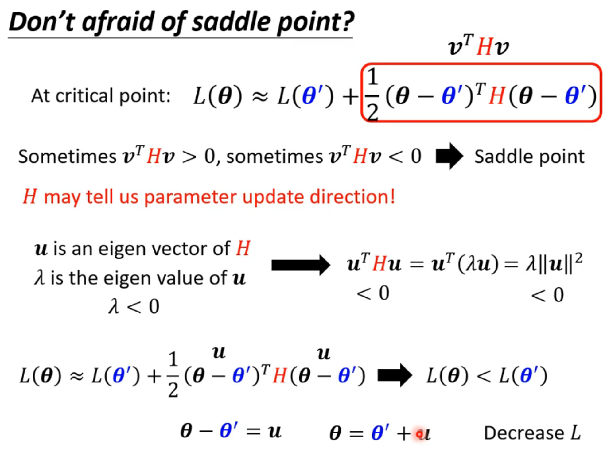
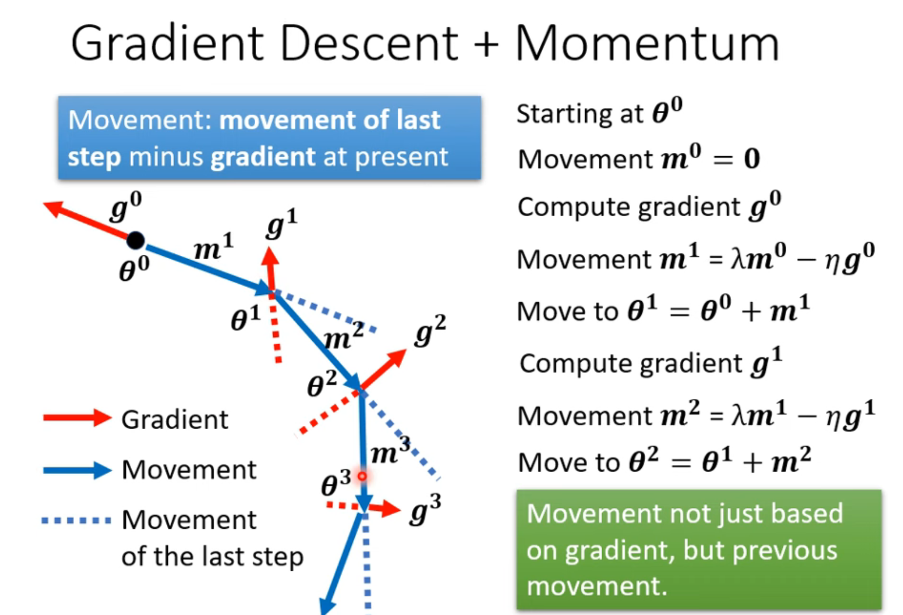

# 1. Minimum , overfitting and Saddle Point

>1. Only the **loss on testing data** is **large** and **loss on training data** is **small**,it is called **overfiting**
## 1. solve overfitting:
### 1. more training data
### 2. data augmentation
### 3. constrained model(make yout model simpler)
## 2. but the overfitting and model bias's solutions is conflict,so we need trade-off
### 1. split your training data into training set and validation set for model selection(n-fold cross validation)
## 3. Local minima or siddle point?
### 1. Hessian matrix--$L(\theta)=L(\theta')+\frac{1}{2}(\theta-\theta')^TH(\theta-\theta')$
#### 1.possitive definite--Around $\theta':L(\theta)>L(\theta')$ -- Local minima
#### 2.negative definite--Around $\theta':L(\theta)<L(\theta')$ -- Local maxima
#### 3.some possitive ,some negative--Around $\theta':L(\theta)>L(\theta')$ or $\theta':L(\theta)<L(\theta')$ -- siddle point
>1. if it is a siddle point,you can use eigen value to solve it.
>2. because the dimension is very high, local minima almost never occur.
# 2. Batch and Momentum
## 1. small batch vs large batch
### 1. Larger batch size does not require longer time to compute gradient
### 2. smaller batch size has better performance.What's wrong with large batch size?-->Optimization Fails (larger batch size is easier to stay in local minima)
### 3. small batch is better on testing data
## 2. Momentum:movement of last step minus gradient at present
> 1. 
# Learning rate
## 1. different parameters needs different learning rate
$\theta^{t+1}_i=\theta^t_i-\frac{\eta}{\sigma^t_i}g^t_i$
1. Root Mean Square(used in **Adagrad**):$\sigma^t_i=\sqrt[\frac{1}{2}]{\frac{\sum^{t}_{n=0}(g^n_i)^2}{t+1}}$
2. RMSProp:$\sigma^t_i=\sqrt[\frac{1}{2}]{\alpha*(\sigma^{t-1}_i)^2+(1-\alpha)*(g^t_i)^2}$
3. Adam:RMSProp+Momentum
## 2. Learning Rate Scheduling
1. Learning Rate Decay:As the training goes,we are closer to the destination,so we reduce the learning rate.
>$\theta^{t+1}_i=\theta^t_i-\frac{\eta^t}{\sigma^t_i}g^t_i$
2. Warm Up:Increase and then decrease
# Classification
## 1. Class as one-hot vector
## 2. softmax:$y'_i=\frac{exp(y_i)}{\sum_{j}exp(y_{i})}$
$$
\begin{align}
\mathbf{y'} &= softmax(\mathbf{y}) \tag{1} \\
\mathbf{y} &=\mathbf{b'}+\mathbf{W'}*\sigma(\mathbf{b}+\mathbf{W}*\mathbf{x}) \tag{2} 
\end{align}
$$
## 3. Loss of Classification:Cross-entropy
$e=-\sum_{i}\hat{y}_i*lny'_{i}$
> Minimizing cross-entropy is equivalent to maximizing likelihood
# Feature Normalization
For each dimension : i
mean : $m_i$
standard deviation : $\sigma_{i}$
$\hat{x}^{r}_i=\frac{x^{r}_{i}-m_i}{\sigma_{i}}$
then the means of all dims are 0,and the variances are all 1.
> In general,feature normalization makes gradient descent converge faster
> And every layer's output also needs Feature normalization