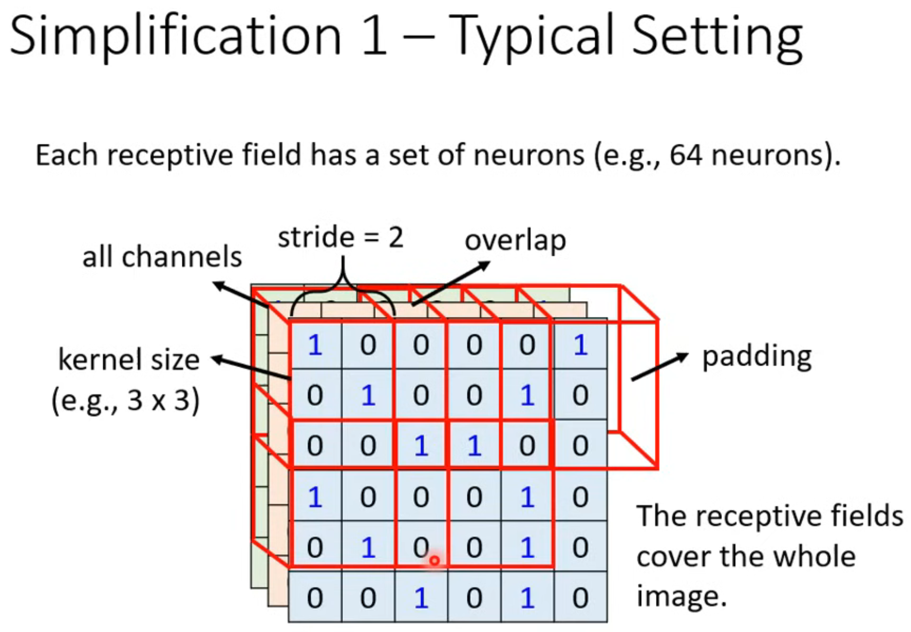
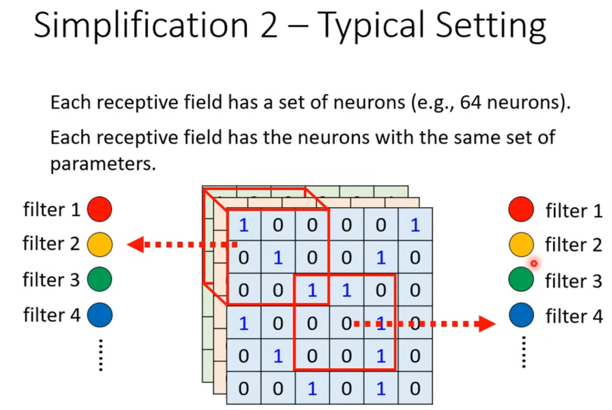

# CNN
for example,a picture with size "3x100x100".if we us ***Fully Connected Network***,we need compute so many weights($3*10^7$),making it easily overfitting.
So ***Do we really need "fully connected"*** in image processing?
1. Observation 1:Identifying some critical patterns.Perhaps human also identify birds in a similar way.So we don't need to see the whole image.
   * simplification 1: 
   > There are so many key words,so I use picture not markdown.(I'm lazy.)
2. Observation 2:The same patterns appear in different regions.
   * Simplification 2:Sharing parameters.
3. Pooling:In order to improve the computing speed,we use Pooling.Pooling will ignore some data.
   * Not all convolutions use pooling.
4. CNN is not invariant to scaling and rotation(we need data augmentation).
# Self-attention
How to solve "Input is a set of vectors(may change length)"?
Such as words,Graph.
If we use One-hot Encoding,we can't get the relation between different words.
We use ***Word Embedding***
1. What is the output?
   * Each vector has a label.
   * The whole sequence has a label.
   * Model decides the number of labels itself.
2. Sequence Labeling.
   * We need to consider the neighbor.
   * Self-Attention can solve it.
3. Self-Attention:
   * input:Can be either input or a hidden layer's output.
   > $\mathbf{a^1,a^2,a^3,a^4}......$
   * compute attention:Dot-product
   > $$
   \begin{align}
   \mathbf{q} &= \mathbf{W^q}\mathbf{a^1} \tag{1} \\
   \mathbf{k} &= \mathbf{W^k}\mathbf{a^2} \tag{2} \\
   \alpha &= \mathbf{q}\cdot\mathbf{k}\tag{3} \\
   \alpha_{1,1} &= \mathbf{q^1}\cdot\mathbf{k^1} \tag{1} \\
   \alpha_{1,2} &= \mathbf{q^1}\cdot\mathbf{k^2} \tag{2} \\
   \alpha_{1,3} &= \mathbf{q^1}\cdot\mathbf{k^3} \tag{3} \\
   \alpha_{1,4} &= \mathbf{q^1}\cdot\mathbf{k^4} \tag{4} \\
   \end{align}
   $$
   * softmax:$\alpha'_{1,1},\alpha'_{1,2},\alpha'_{1,3},\alpha'_{1,4}$
   * Extract information based on attention scores:$$
   \begin{align}
   \vec{b}^1 &= \alpha'_{1,1}\vec{v}^1+\alpha'_{1,2}\vec{v}^2+\alpha'_{1,3}\vec{v}^3+\alpha'_{1,4}\vec{v}^4 \tag{1} \\
   \vec{v}^1 &= \mathbf{W}^v\mathbf{a}^1 \tag{2} \\
   \vec{v}^2 &= \mathbf{W}^v\mathbf{a}^2 \tag{3} \\
   \vec{v}^3 &= \mathbf{W}^v\mathbf{a}^3 \tag{4} \\
   \vec{v}^4 &= \mathbf{W}^v\mathbf{a}^4 \tag{5} \\
   \end{align}$$
   > The closer $\vec{b}^1$ is to someone, the closer its value will be to that's value.
   * Matrix form:$$\begin{align}
   \mathbf{Q} &= \mathbf{W}^q\mathbf{I} \tag{1} \\
   \mathbf{K} &= \mathbf{W}^k\mathbf{I} \tag{2} \\
   \mathbf{V} &= \mathbf{W}^v\mathbf{I} \tag{3} \\
   \mathbf{A} &= \mathbf{K}^T\mathbf{Q} \tag{4} \\
   \mathbf{A}' &= sofmax(\mathbf{A}) \tag{4} \\
   \mathbf{O} &= \mathbf{V}\mathbf{A}' \tag{5} \\
   \end{align}$$
   * Positional Encoding:Each position has a unique positional vector $e^i$
   > $e^i+a^i$
   * self-attention vs CNN
      * CNN is good for less data.
      * Self-Attention is good for more data. 
      * Self-attention is the complex version of CNN.