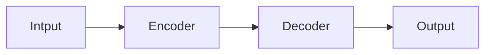
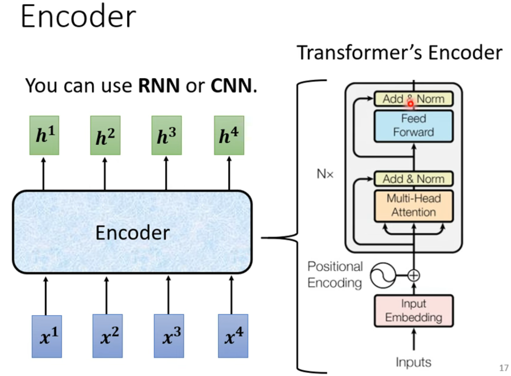
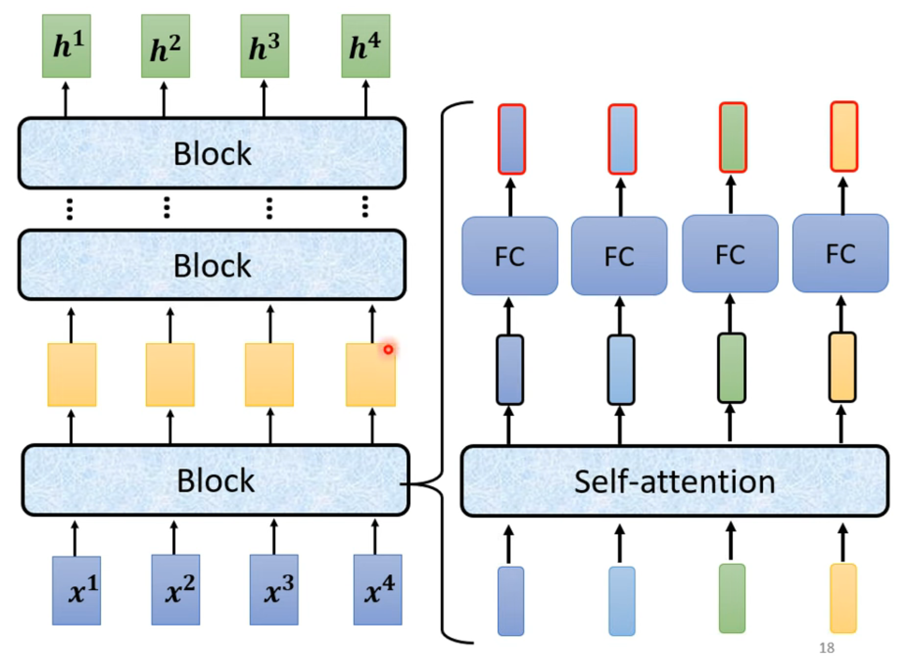
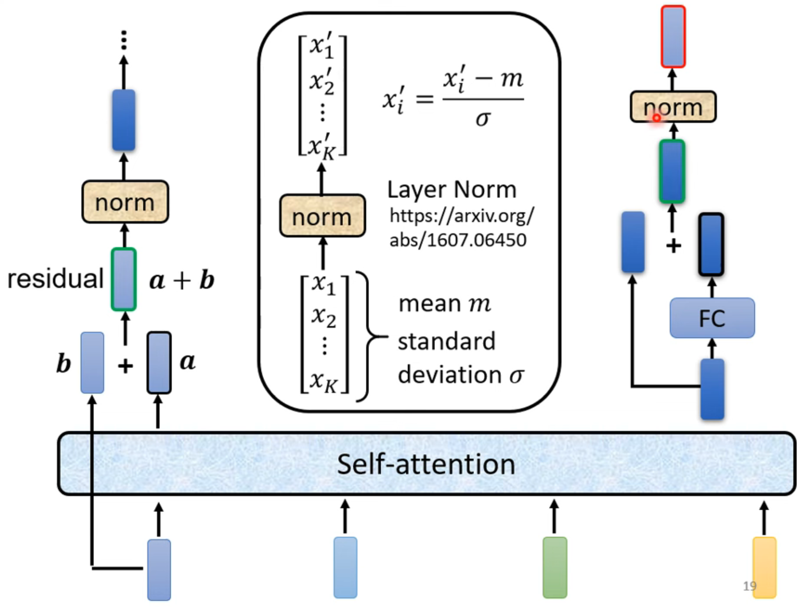
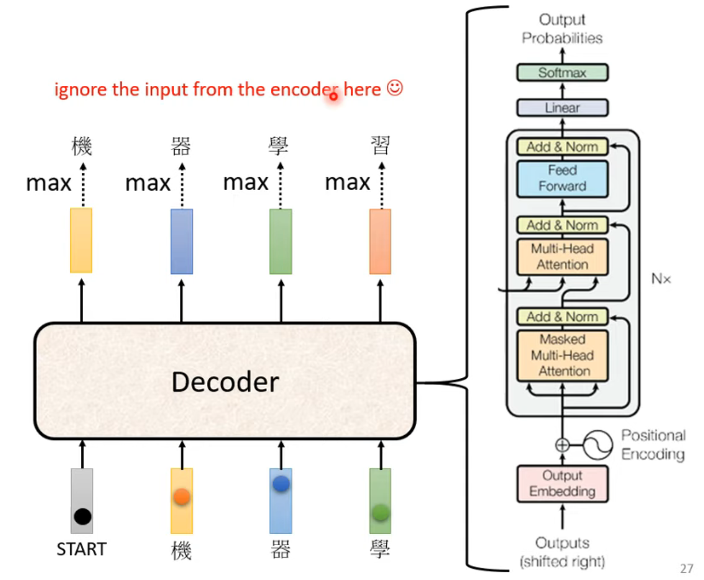
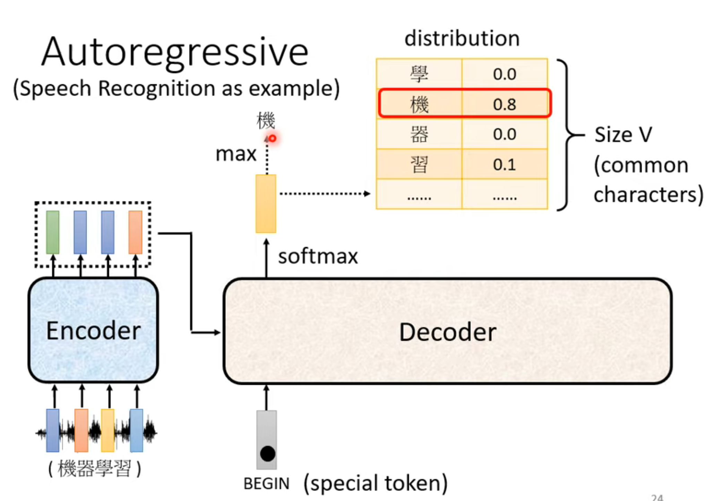
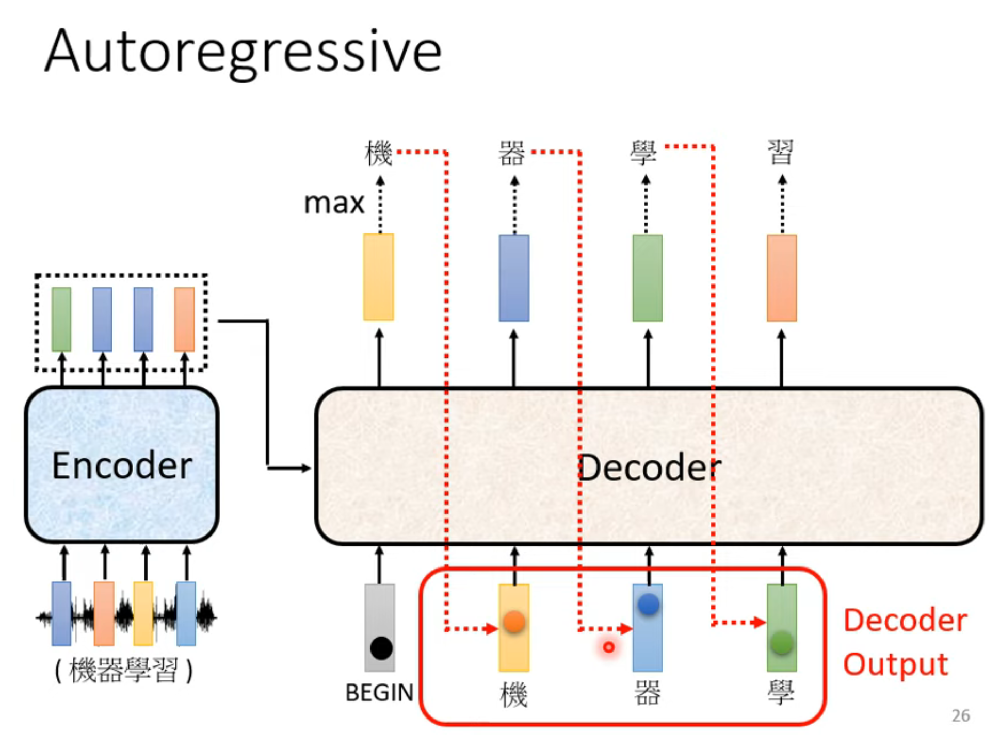

# Transformer
* Sequence-to-sequence(Seq2seq)
* Input a sequence,output a asequence
* The output length is determined by model.
  > Speech Recognition,Machine Translation,Speech Translation.

## Encoder
1. Encoder structure:
2. Encoder's detail:
3. Block's structure:
   > 1. $(x'_i-m)$ 's $x'_i$ don't have the *'*
   > 2. This norm is layer norm.
## Decoder
> such as Autoregressive(AT)
1. Decoder 's structure:
2. Decoder 's process: 
**But we don't know the correct output length.**
**So we need a special character "end".**
## Train
1. We need to label the video.Then make a cross-entropy between Ground truth and the distribution(Decoder softmax's output).And minimize the loss.
   >It's familiar with Classification.
2. Teacher Forcing:using the ground truth as Decoder's input.
## Tips(in training Seq2seq)
1. Copy Mechanism
2. Guided Attention
3. Beam Search
4. Scheduled Sampling