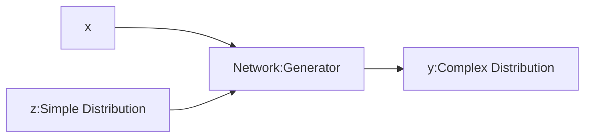
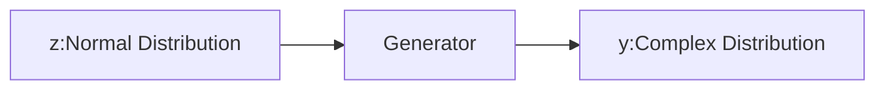
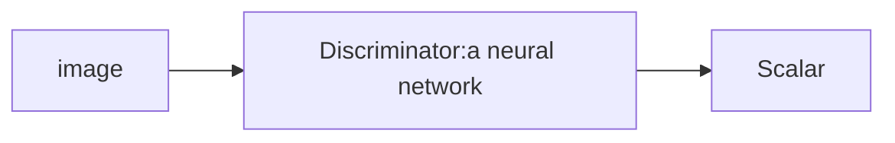
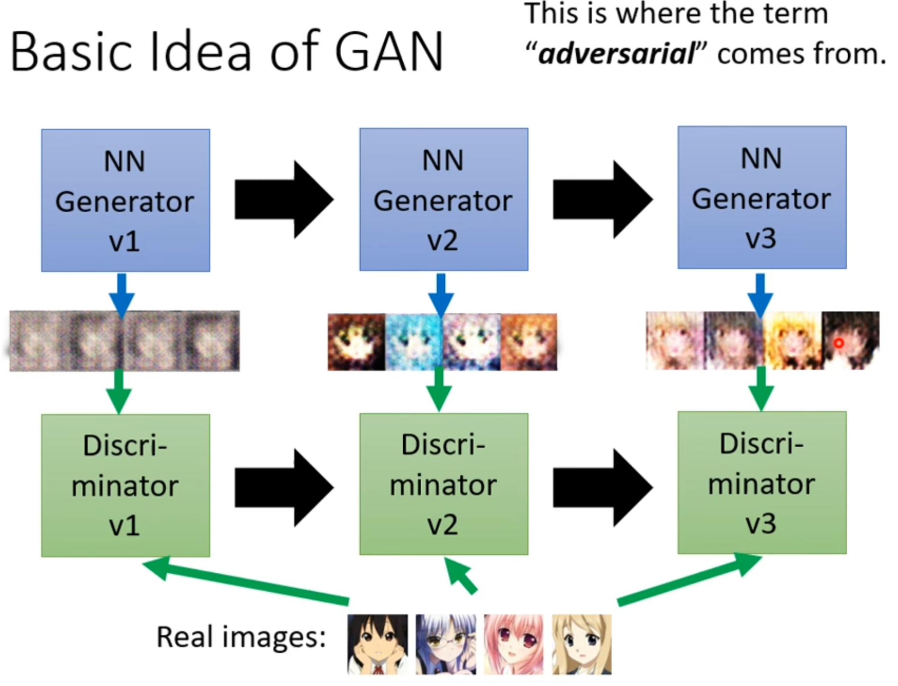

# Genneration
Network as Generator

> We know z's formulation,so we can smple from it.
Why we need Generate?
* Especially for the tasks needs "Creativity"(The same input has different outputs.)
## Generative Adversarial Network(GAN)
* Unconditional generation:
1. Train a Generator

> z:Low-dim vector,y:High-dim vector.
> z can be other distribution.
2. Train a Discriminator:

> Scalar:Larger means like the real;smaller means unlike the real.
> you can use CNN.
* Basic Idea of GAN

> Seemingly enemies but actually friends.
> mutual promotion
* Algorithm of GAN
  1. Initialize generator and discrimininator.
  2. in each training iteration:
   * Fix generator G,and update discriminator D.
   * Sample some photo in Database.
   * Discriminator learns to assign high scores to real and low scores to generated objects.
   * Fix discriminator D,and update denerator G.Gennerator learns to "fool" the discriminator.
   * Repeate.
## Theory behind GAN
1. loss:
   $G^*=argmin_{G}Div(P_{G},P_{data})$
   > $P_G$ is the pred.$P_{data}$ is the truth.
   > Divergence between distributions $P_G$ and $P_{data}$.
   But how to compute the divergence?
2. * Sample data from Database as $P_{data}$ ,sample data from G as $P_G$
   * Training:$D^*=\argmax_{D}V(D,G)$
   > $V(G,D)=E_{y \sim P_{data}}[logD(y)]+E_{y \sim P_{G}}[log(1-D(y))]$
   > $D^*=\argmax_{D}V(D,G)$ = Training classifier (**$P_{data}$** get high score and **$P_G$** get low score.)
   > the value of $max_{D}V(D,G)$ is related to JS divergence.
## Tips for training GAN
1. What is sthe problem of JS divergence?
   * JS divergence is always log2 if two distributions do not overlap.
   > In most cases, $P_{G}$ and $P_{data} are not overlapped.$
   * Intuition:If two distributions do not overlao,binary classifier achieves 100% accuracy.
   * The accuracy(or loss) means nothing during GAN training.
2. Wasserstein distance
   * Considering one distribution P as a pile of earth , and another distribution Q as the target.
   * The average distance the earth mover has to move the earth.
   * $W(P,Q)=d$
   * But there are many possible "moving plans"!!!
   * Using the  "moving plan" with the smallest average distance to define the Wasserstein distance.
   * WGAN:$$\max_{D\in 1-Lipschitz}(E_{y\sim P_{data}}[D(y)]-E_{y\sim P_{G}}[D(y)])$$
   > D means Discriminator
   > D has to be smooth enough.
   > Without the constraint,the training of D will not converge.
   > Keeping the D smooth forces D(y) become $\infty$ and $-\infty$.