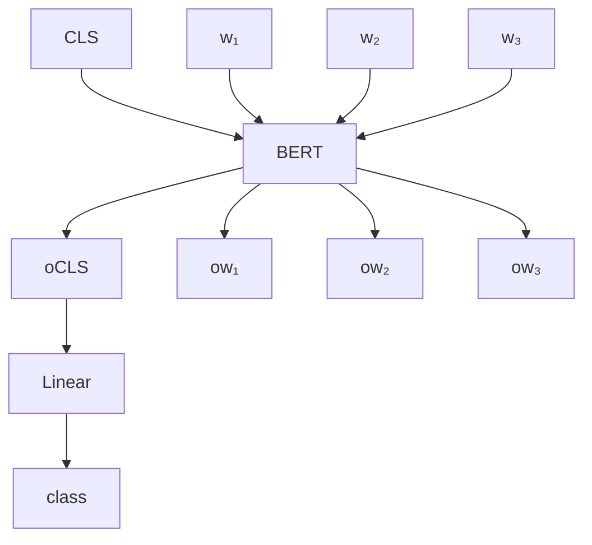
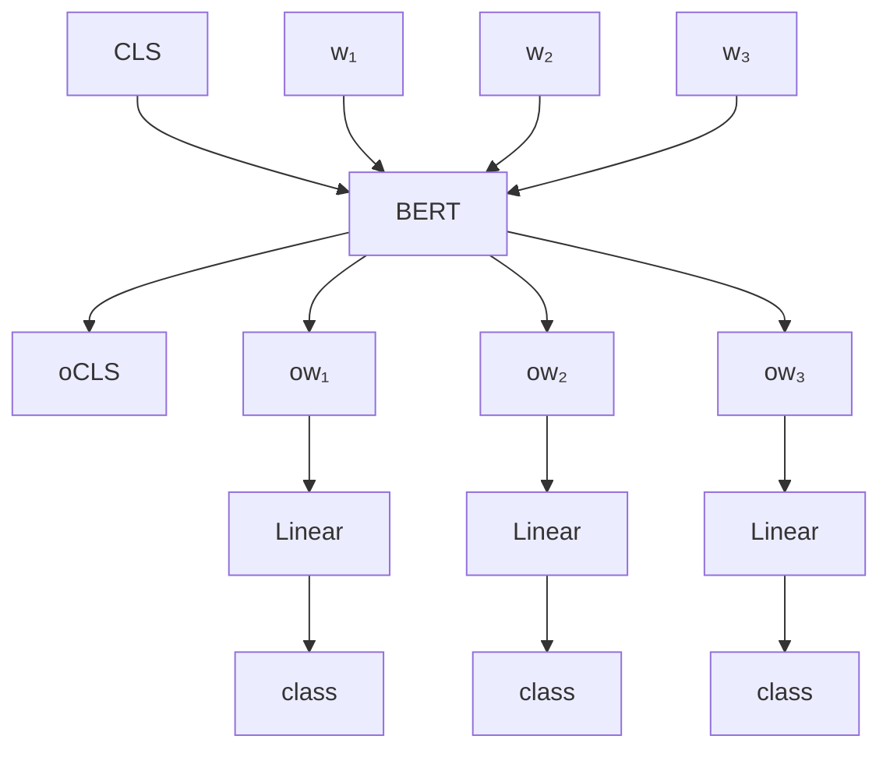
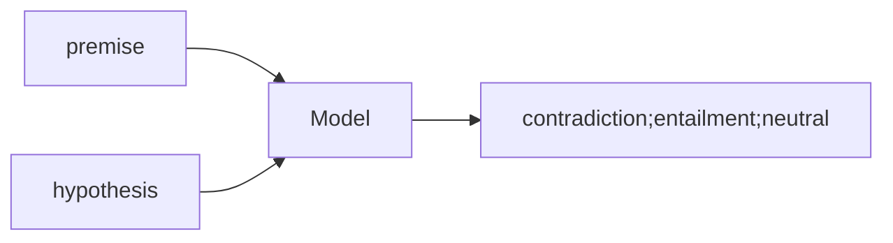

# Self-Supervised Learning
## BERT
1. intput : a sequence,and randomly masking some tokens.
2. you can use a special token or a random token as mask.
3. output:the ture word which was masked before.
4. loss:cross entropy.
5. similiar to classification.
6. Next Sentence Prediction
> This approach is not helpful.
7. It looks like BERT only can do some gap-filling.But it can solve mmany Downstream Tasks.We call it ***Fine-tune***.Make a BERT called ***Pre-train***
> Downstream Tasks:
> * The tasks we care
> * We have a little bit labeled data.
## How to use BERT
1. Sentiment analysis
   * Input:sequence
   * Output:class

> CLS:a flag of sentence's beginning
> class:judge the sentence(positive or negative)
> Linear:Random initialization
> BERT:Init by pre-train(performance is better than random) and the one that has been trained can do fill-in-the-blank questions.
2. POS tagging
   * Input:sequence
   * Outout: same as input

3. Natural Language Inferencee(NLI)
   * Input:two sequence
   * Output:a class
